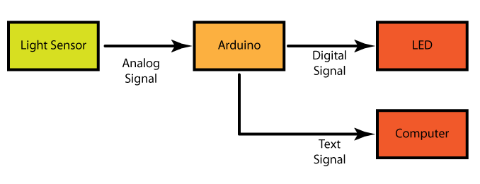

Tutorial 2: Light Sensor to LED by Malcolm Knapp
===========

# Introduction
This tutorial shows you how to switch out the potentiometer for a light sensor. We will go through how to change the electronics and code to make this new system give you the same behavior as the Potentiometer to LED. The trick about this code is that the Light Sensor does not have the same input range as the potentiometer. As you saw before with the potentiometer, sensorValue can range from 0 to 1023. The light sensor resistance does not change as much as the potentiometer and so the range of . We will show you how to find this new range and update the code so it will have the same behavior as before 

#Block Diagram

# Circuit
* Unplug the Arduino. When you are change hardware the circuit should not be powered. That way you can avoid things like short circuits.
* To set up the circuit see the fritzing diagram for this tutorial
* Plug the Arduino back in 

# Code
* Save the Potentiometer to LED code as Light Sensor to LED
* Now we need to add some variables to store the min and max sensor values. You can see where to add them in the Code Difference pdf

	int maxValue = 1023;
	int minValue = 0;

* Upload the code, open the Serial Monitor, and see what the Sensor Values are. Now cover up the light sensor with you finger and see what the Sensor Values are. The sensor value should range from around 300 to around 750. Also notice the the delay reported is the same as the sensor value.
* Update the minValue variable to the minimum sensor value you saw minus another 50. So if the minimum value you saw was 311 set minValue to 260. Update the maxValue to the maximum sensor value you saw plus 50. This is called adding a safty factor and in prevents noise from causing bad behavior.
* Now we need a way of mapping the min and max values from the light sensor back to the range from 0 to 1023. We can do this with the <a href = http://arduino.cc/en/reference/map >map</a> command. 
* Click on the link and read the reference about how the map command works. 
Then update this line 

	delayTime = scaling*sensorValue;

to 

	delayTime = map (sensorValue, minValue, maxValue, 0, 1023);

* The map function takes in the sensor values and scales it from its range (In this case from ~300 to ~750) to the original range we had (0 to 1023)
* Upload the code again and see how the dealy in milliseconds in no longer equals the sensor value. You will still not get the complete range becuase of the saftey margin you added but you will get very close.  
* NOTE: If you ever see a negative value for the delay in millseconds in the serial monitor it mean you  do not have enough safety margin. Increase the maxValue and reduce the minValue variables to deal with this problem.
* The last this to do is updating the descriptions to match the hardware. See the Code Differences to see the changes.  This may seem trivial but it is becomes really useful as your project get more complex. Think of it as explaining what you are doing to your self six month or a year from now. 
* You are done with this tutorial! We change our input from a potentiometer block to a light sensor block. The singal output by these blocks is the same so we do not have to change the input code. However the range of sensorValues is different so we have to update the Processing to keep the same behavior. 
* You can now go on to tutorial 3.