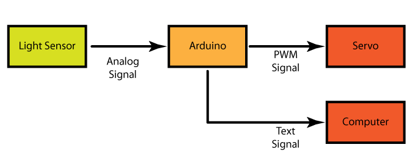
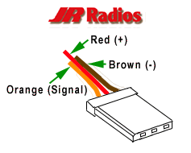

Tutorial 3: Light Sensor to Servo by Malcolm Knapp
===========

# Introduction
In Tutorial 3 we are going to replace the LED with a servo and make it "blink". What "blink" means in the case is that the servo will switch back and forth between two difference positions. A servo has a <a href=http://arduino.cc/en/Tutorial/PWM> PWM </a> interface so we will have to generate a PWM signal from the Arduino. You can click on the link to read more about PWM and how it works if you want to. The Uno can generate a PWM signal from pins 11,10,9,6,5, and 3. In this case we will be using pin 9. The other important thing using a servo is that is it easiest to use a library to control it. This prebuilt code means we can tell the servo to move to the 105 degree positon and not worry about exactly what PWM duty cycle is needed to do that. Conveniently, a library for exactly that comes built into Arduino. It is called Servo. To use the library we will have to add some lines of code to the sketch which you will see in the Code section. 

# Block Diagram

# Circuit
* Unplug the Arduino. When you are change hardware the circuit should not be powered. That way you can avoid things like short circuits.
* To set up the circuit see the fritzing diagram for this tutorial. NOTE: The color do not match up so use the the pinout below to see what the signals are. 

* Plug the Arduino back in 

# Code
* Save the Light Sensor to LED code as Light Sensor to Servo
* Using a library. There are three things you must do to use an Arduino the library. The first is you need to add the the library into the code. So add the line

	#include <Servo.h>

to the Included Library section. 

* Then in you need to initialize an object from that library. In this case we need create a servo object. So add the line  

	Servo myservo;  

to the Library Initialization Section. The line above tells Arduino to create the object and name it "myservo". 

* After the object has been created you then setup that object. Add the line 

	myservo.attach(9);  // attaches the servo on pin 9 to the servo object

to the Hardware Declaration Section . It tell the arduino that the servo is connected to pin 9 and to generate the PWM signal there.

* The next thing we need to do is update the map function so change

	delayTime = map (sensorValue, minValue, maxValue, 0, 1023);

to

	delayTime = map (sensorValue, minValue, maxValue, 200, 1023);

This sets the minimum delay to 200ms. The reason why we need to do this is because the servo responds much slower that the LED. Therefore if you had delays less than 200ms the servo would not have enough time to move between positions and it would not "blink"

* Finally we need to convert the output code from turning the LED on and off to moving the servo back and forth. So change the code 

	digitalWrite(ledPin, HIGH); // turn the ledPin on
	delay(delayTime);          
	digitalWrite(ledPin, LOW);   // turn the ledPin off
	delay(delayTime);

to 

	myservo.write(155); 
	delay(delayTime); 
	myservo.write(30);
	delay(delayTime);

This code will move the servo between 30 degrees and 155 degree. The reason why it is not between 0 and 180 degrees is that this specific servo does not have that wide a range. Other servo can go the full range and some even can turn continuously in one direction.

* There is one last thing we need to do as clean up. You will notice that we no longer have any hardware connected to pin 13. It is good practice to remove any code that is not doing anything so lets remove the line 

	int ledPin = 13;      // select the pin for the LED

and the line 

	 pinMode(ledPin, OUTPUT);  

This means we will not be confused when we look at the code later.

* Upload the code and see the servo "blink"! 
* Open the Serial Monitor and see how the delay values have changed
* Now cover up the light sensor and change the blink rate. So now we have a system with completely different input and output block but the behavior is the same. The Arduino is processing the signal from the light sensor and converting in into the PWM signal the servo requires. 
* The last this to do is updating the descriptions to match the hardware.
* You are done with this tutorial! You can now go on to tutorial 4.