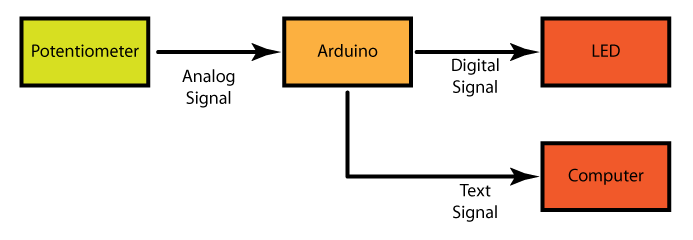

Potentiometer to LED
===========

# Introduction
This series of tutorials focuses on demonstrating the power of system thinking. We will start with the Potentiometer --> Arduino --> LED system you have seen in the beginning class. We will then switch out the inputs and the outputs and then change the code to adapt the input to the output. Throughout this whole series the system will have the same behavior. This is the input will control the blink rate of the output. To begin with we will go through the code you have seen before. This tutorial will focus on how the code is organized and how to see what the code is doing while it is running. 

#Block Diagram

# Circuit
* Use the Fritzing diagram from the morning class to put this circuit together. ??

# Code
* This tutorial starts with code that has identical functionality as the AnalogIn example. The main thing that is different this code and the AnalogIn code is that the comments are different and it uses <a href="http://arduino.cc/en/reference/serial">Serial</a>  commands. This makes it easy for us to see what the code is doing and make the code much easier to debug. This also changes the system because it adds a block. The original system was 

and the new system is 

	

* Upload the code and confirm it works the same way as the code this morning did.
* Open up the <a href="http://arduino.cc/en/guide/Environment#serialmonitor">Serial Monitor</a> and see how the information is displayed
* Remove the "ln" from the line

	Serial.print("Sensor value: ");  Serial.println(sensorValue);

Upload the code again and see how the output changes.
* Put the "ln" back in and upload the code again and confirm you get back to the original behavior
* You are done with this tutorial! You can now go on to tutorial 2.
