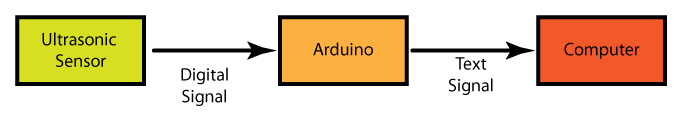

Tutorial 5: Ultrasonic Sensor to Computer by Malcolm Knapp
----------

# Introduction
This tutorial turns your computer screen into one giant LED. You will be able to control the blink rate of you computer screen with the ultrasonic sensor. This is a little over kill :) but the point is that your computer becomes the output for the arduino. To do this we will use a new program called <a href="http://www.processing.org/">Processing</a>. If you do not have it on your computer you should <a href="https://www.processing.org/download/">download</a> and install it. Processing is the equivalent of Arduino but it works on the Computer as opposed to a microcontroller. It was originally made to make it easier to do computer art visualizations and other computations. We will be using a prebuilt sketch that you can download from the tutorial page???. This code uses the Processing equivalent of the Serial library to receive messages from the Arduino. The key thing about this though is that the Processing code uses the Serial port on the computer so you can run the Serial Monitor at the same time as this code. 

Whenever you are sending messages you run into a series of issues. The first one is how do does the computer know when the message being sent is complete. In human speech we know when that someone is done talking when they stop. The computer does not have eyes and is much less sophisticated so it can not do this. Instead we must specifically tell the computer when the message is done. We do this with what is called a termination character. This is a single character that is put at the end of the message and the moment the computer sees this message they process the message??? Any character can be used for this but it is best if it one that will never be used in a message. Conveniently is problem has been solved already. All of the character you see on this screen are part of the <a href="http://www.asciitable.com/">ascii character set</a>. This defines the binary sequence the represent "a", "b", etc. They included in the set characters that exist but are not display. One of the is the New Line character or the number 13. This character tell the computer when to display character on the next line of the screen. You can think of it as what is done when you hit the Return key on your keyboard. Because this character is never displayed it makes a great termination character. 

# Block Diagram

# Circuit
* To set up the circuit see the fritzing diagram for this tutorial
* NOTE: the ulrasonic sensor gives false readings if the distance to the object is greater than the max distance in the code. For testing be sure that you have a object (like a box) that at a distance less than the max. 

# Code
* Save the "Ultrasonic to Servo" code as "Ultrasonic to Computer"
* We no longer have the servo in the circuit so remove the lines

	
    #include <Servo.h>
    ...
    Servo myservo;  // create servo object to control a servo a maximum of eight servo objects can be created
 	  ...
 	  myservo.attach(9);  // attaches the servo on pin 9 to the servo object

* We need to add the termination character variable. Remember the in ascii 13 represent the "New Line" character

	
    char Terminator = 13;  

* Then we need to replace the lines that moved the servo with the lines that send message to the computer. So replace the lines 

    myservo.write(155);
    delay(delayTime); 
    myservo.write(30);
    delay(delayTime);  

 with 

    Serial.print("ON"); Serial.println(Terminator, DEC);
    delay(delayTime);        
    Serial.print("OFF"); Serial.println(Terminator, DEC);
    delay(delayTime);                  

* Upload the code to the Arduino 
* Open Computer Blink.pde
* Run Computer Blink
* You should see the Serial stream start the appear at the bottom of the Processing window. And the window that pops up should change from white to block at a rate control by the Ultrasonic sensor.  
* If you do not see this find the name of the serial port in the list that appears when the program is started. If it is not at the top of the list enter its location in the following line. NOTE: this list is zero indexed so you the top of the list is location "0" not "1"

    myPort = new Serial(this, Serial.list()[<serial port location>], 9600); // This looks at the    first port in the Serial List

* To end the Processing program hit any button on the keyboard. 
* OPTIONAL: Make the screen the same size as you computer screen buy changing the dimensions in the line 

	size (400, 400);

to the size of your screen. The run the program again. Now you have a one really expensive LED!