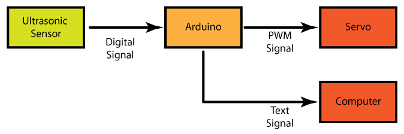

Tutorial 4: Ultrasonic Distance Sensor to Servo by Malcolm Knapp
===========

# Introduction
This tutorial replaces the Light Sensor with a <a href=""> Ultrasonic Distance  Sensor</a>. This sensor sends out high frequency sound pulses and times how long it takes for them to come back much like a bat does. The interesting thing about is that this sensor produces a digital signal as opposed to an analog signal. To make this sensor easy to use a library was made called the NewPing library. This library takes the digital signals coming from the ultrasonic sensor an converts them into a the time between when the ultrasonic sensor sent a pulse and when it received it back. This may be a little hard to understand so the library  define conversion factors that will convert this duration into a distance. In this tutorial we will use the "US_ROUNDTRIP_CM" variable and is equal to 57us/cm. Since US_ROUNDTRIP_CM already define by the NewPing library we do not need to define it in our code. 

#Block Diagram

# Circuit
* To set up the circuit see the fritzing diagram for this tutorial

# Code
* Save the "Light Sensor to Servo" code as "Ultrasonic to Servo"
* This code uses another library called NewPing. Unlike the Servo library this one does not come with the Arduino program so you will have to add it your self. You can down load it from the page for this tutorial. 
* Now Select Sketch --> Import Library --> Add to Library... and navigate to where you downloaded it to you.
* Restart Arduino and you should see NewPink in the File --> Examples list
* Open the NewPinExample from the Examples list and upload it to the Arduino
* Open the Serial Monitor and confirm and distance is displayed and it changes as you move your hand closer or further away from the sensor. 
* Open the "Ultrasonic to Servo" code again and include the NewPing Library. You can see the Tutorial 4 Code Differences pdf for details
* Echo and Trigger signals are connected to pins 11 and 12 add those pin defines to the code
*	Now we need to initialize a Ultrasonic Sensor object so add the following to the library initialization section

	NewPing sonar(triggerPin, echoPin, maxDistance);

* The triggerPin and echoPin you have seen before but the maxDistance you have not. This library requires that you define the maximum distance you will be measure. The sensor has a max distance of 400cm but for this case lets define a max distance of 200cm. So add 

	int maxDistance = 200;   // in centimeters

to the variable initialzation section of the code. 
* The big change we have is that we are no longer reading the analog pin to get our sensor value, we are reading the Ultrasonic sensor object for information so we need to change 

	sensorValue = analogRead(sensorPin); 

to

	delay(50);  // Wait 50ms between pings (about 20 pings/sec).
	uS = sonar.ping(); // Send ping, get ping time in microseconds (uS).
	distance = uS / US_ROUNDTRIP_CM;  // convert time to distance

The "delay(50)" guarantees that there will be enough time for the ultrasonic sensor to send and receive a signal before the next request comes. The sonar.ping() call returns?? its measurement in microseconds between when the pulse was sent out and when it was received. This is a little hard to understand so it is then converted to distance in centimeter. 
* We do need to defince the "uS" and "distance" variables so lets add them to the variable initialization section.  

	unsigned int uS = 0;      // holds the time it took for the pulse to be recieved
	unsigned int distance = 0; // holds the distance in centimeters

* Then we need to update the map function to reflect that we are reading the ditigal pins the ultrasonic sensor is connected to and not the analog input. So remove the line

	int sensorValue = 0;  // variable to store the value coming from the sensor

and change the line 

	delayTime = map (sensorValue, minValue, maxValue, 200, 1023);

to 

  	delayTime = map (distance, minValue, maxValue, 200, 1023);

* Finally we need to update our max and min values to reflect what the new sensor will read. 

	int maxValue = 200;    // in centimeter
	int minValue = 5;      // in centimeter

* Update the comments to reflect the new circuit you have made
* You are done with tutorial! If you want see some more advanced topics to you can go to tutorial 5 but that is optional. 
